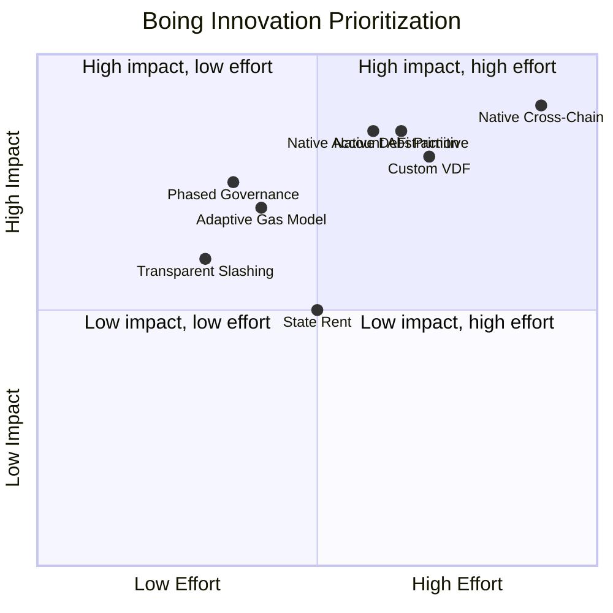
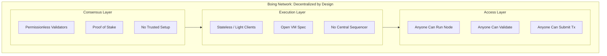
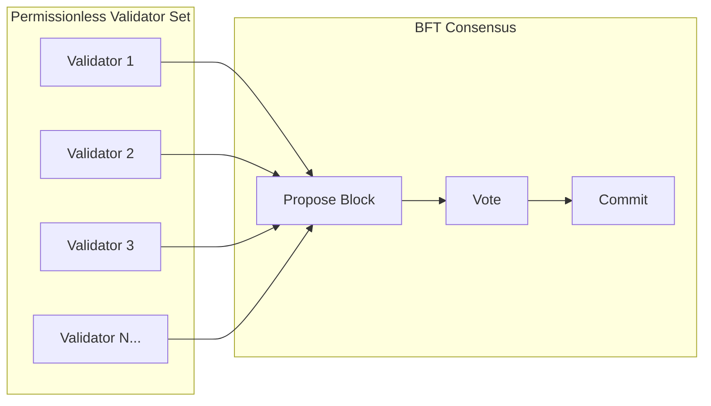
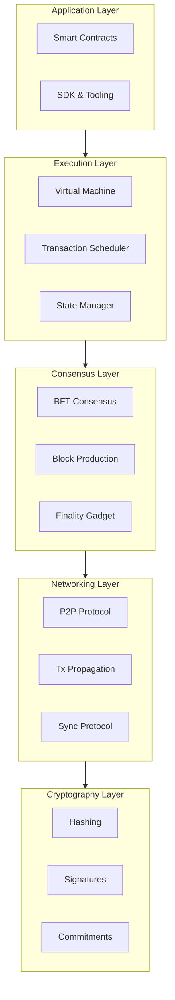
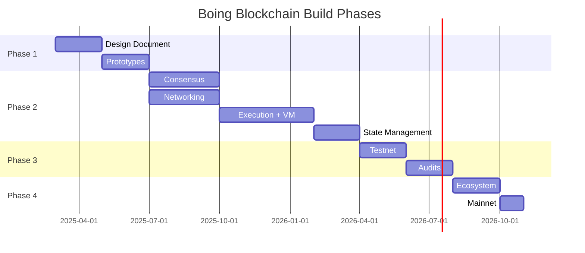

# Boing Blockchain: Authentic Network Design Plan

> **Core Principle:** An authentic, unique L1 blockchain built from first principles — optimized for efficiency, free from dependencies on other chains, designed for **absolute decentralization**, and committed to **100% transparency** in how we build, govern, and operate.

---

## Table of Contents

1. [Design Philosophy](#design-philosophy)
2. [Transparency: 100% Open by Design](#transparency-100-open-by-design)
3. [Priority Pillars](#priority-pillars)
4. [Decentralization: A Non-Negotiable Requirement](#decentralization-a-non-negotiable-requirement)
5. [Innovation: Unique Boing Features](#innovation-unique-boing-features)
6. [Core Design Decisions](#core-design-decisions)
7. [Borrowing Optimal Ideas (Without Dependencies)](#borrowing-optimal-ideas-without-dependencies)
8. [Tech Stack & Implementation](#tech-stack--implementation)
9. [Phased Discovery & Build Plan](#phased-discovery--build-plan)
10. [Suggested "Authentic Boing" Configuration](#suggested-authentic-boing-configuration)
11. [Unique Use-Case: Cross-Chain DeFi Coordination Layer](#unique-use-case-cross-chain-defi-coordination-layer)
12. [UX & Human-Centered Innovation](#ux--human-centered-innovation)
13. [Technical Innovations for Ecosystem Improvement](#technical-innovations-for-ecosystem-improvement)
14. [Success-Based dApp Incentives, Boing SDK & Decentralized Automation](#success-based-dapp-incentives-boing-sdk--decentralized-automation)
15. [Bootstrap & Validator Incentives (Sustainability-First)](#bootstrap--validator-incentives-sustainability-first)
16. [BOING Tokenomics — Sustainable Value Design](#boing-tokenomics--sustainable-value-design)
17. [Practical Considerations](#practical-considerations)
18. [Discovery Checklist](#discovery-checklist)
19. [Deepening Decentralization & Enhancement Vision](#deepening-decentralization--enhancement-vision)

---

## Design Philosophy

The Boing blockchain is conceived as a **greenfield L1** with the following pillars:

- **Authentic** — Your own architecture, not a fork or framework
- **Independent** — Zero reliance on Solana, Cosmos, Ethereum, or other chains
- **Optimal** — Adopt the best ideas from the ecosystem when they’re demonstrably superior
- **Unique** — A distinct identity and technical story
- **Decentralized** — Absolute decentralization as a foundational requirement
- **Transparent** — 100% transparent in how we build, govern, and operate — trust through verifiability, not promises

---

## Transparency: 100% Open by Design

**Principle:** Community trust is earned through transparency. We commit to 100% transparency in everything we do and how the network is built. No hidden parameters, no black boxes, no “trust us.”

| Commitment | Implementation |
|------------|----------------|
| **Protocol design** | Open design docs, public specs, auditable code. Anyone can verify how the network works. |
| **Tokenomics** | Emission schedules, fee splits, burn mechanics — all on-chain and documented. No surprise minting or parameter changes without governance. |
| **Governance** | On-chain proposals, votes, and outcomes. No backroom deals; all decisions visible and auditable. |
| **Validator & staking** | Clear slashing conditions, reward formulas, and distribution. Delegators see exactly how rewards flow. |
| **Treasury & spending** | Public accounts, transparent allocation, governance-approved disbursements. Community can trace every BOING. |
| **Security & audits** | Audit reports public. Known risks disclosed. No security-through-obscurity. |
| **Development** | Open source. Roadmap, progress, and trade-offs discussed openly. Community can contribute and verify. |

**Why it matters:** Trust cannot be decreed — it must be earned. Transparency allows the community to verify that the network behaves as stated, that no single party can act without accountability, and that the rules are enforced fairly. 100% transparency is the foundation for a community that can trust.

---

## Priority Pillars

The Boing blockchain prioritizes, in order:

1. **Security** — Safety and correctness over speed
2. **Scalability** — Throughput and efficient resource use
3. **Decentralization** — Permissionless participation at every layer
4. **Authenticity** — Unique architecture and identity
5. **Transparency** — 100% openness in design, governance, and operations — the foundation for community trust

---

## Innovation: Unique Boing Features

Boing aims to introduce **distinctive functionalities** that differentiate it from other blockchains. The following are candidate innovations. See also [UX & Human-Centered Innovation](#ux--human-centered-innovation) and [Technical Innovations for Ecosystem Improvement](#technical-innovations-for-ecosystem-improvement).

### 1. Native Account Abstraction (Built-in)

| Innovation | Description | Differentiation |
|------------|-------------|-----------------|
| **Native AA** | Account abstraction built into the protocol (not a contract layer). Users can have programmable accounts (gasless, social recovery, session keys) without additional infrastructure. | Ethereum uses EIP-4337 (contract-based). Boing would make AA a first-class protocol primitive. |

### 2. Adaptive Gas Model

| Innovation | Description | Differentiation |
|------------|-------------|-----------------|
| **Dynamic gas** | Gas costs adapt to network congestion and resource usage in real time. Predictable upper bounds with fair prioritization. | Most chains use static gas tables. Boing could introduce a more responsive, fair pricing model. |

### 3. Native Cross-Chain Primitives

| Innovation | Description | Differentiation |
|------------|-------------|-----------------|
| **Protocol-level bridges** | Light client verification and cross-chain messaging as protocol primitives, not third-party contracts. | Bridges today are typically trust-minimized contracts. Boing could design cross-chain into the base layer. |

### 4. Delegated Staking with Slashing Transparency

| Innovation | Description | Differentiation |
|------------|-------------|-----------------|
| **Transparent slashing** | Clear, auditable slashing conditions with appeal mechanisms. Delegators see exactly why validators were slashed. | Improves trust and decentralization of staking. |

### 5. On-Chain Governance with Time Locks

| Innovation | Description | Differentiation |
|------------|-------------|-----------------|
| **Phased governance** | Parameter changes go through time-locked stages (proposal → cooling → execution) to allow for community response and exit. | Reduces risk of sudden, controversial upgrades. |

### 6. Verifiable Delay + Ordering (Boing-specific VDF)

| Innovation | Description | Differentiation |
|------------|-------------|-----------------|
| **Custom VDF** | A verifiable delay function for fair ordering that doesn't depend on any external chain's PoH. Boing-native, audit-friendly design. | Unique to Boing; enables fair ordering without external dependencies. |

### 7. State Rent with Grace Periods

| Innovation | Description | Differentiation |
|------------|-------------|-----------------|
| **Rent with grace** | Inactive accounts pay state rent, but with long grace periods and clear notifications before eviction. Balances state bloat with user experience. | More user-friendly than abrupt state eviction. |

### 8. Native DeFi Primitives (boing.finance Integration)

| Innovation | Description | Differentiation |
|------------|-------------|-----------------|
| **Protocol-level AMM** | A minimal, audited AMM or swap primitive built into the protocol for boing.finance to use. Reduces contract risk. | Most DeFi is fully contract-based. Boing could offer a secure, protocol-level primitive. |

---

### Innovation Prioritization Matrix



---

## Unique Use-Case: Cross-Chain DeFi Coordination Layer

Boing's distinct role in the blockchain ecosystem is to serve as a **DeFi coordination layer** that reduces fragmentation, improves composability, and benefits all chains — not just Boing itself.

### The Problem Boing Addresses

- **Fragmented liquidity** — Value is spread across dozens of chains; users and protocols must bridge, wrap, and duplicate.
- **Trust-heavy bridges** — Most cross-chain infrastructure relies on multisigs or opaque relayers.
- **Poor DeFi UX** — Users juggle multiple wallets, RPCs, and chains to access liquidity.
- **Isolated innovation** — New chains launch in silos; interoperability is an afterthought.

### Boing's Unique Position

**Boing is the native chain for cross-chain DeFi coordination** — a hub where:

| Capability | How It Benefits the Ecosystem |
|------------|-------------------------------|
| **Protocol-level cross-chain primitives** | Light client verification, not third-party relays. Any chain can connect trust-minimally. |
| **Unified liquidity routing** | boing.finance as the coordination front-end; Boing Network as the settlement and routing layer. Reduces fragmentation for users across all chains. |
| **Native DeFi primitives** | Protocol-level AMM, token deployment, and swap logic. Audited, upgradeable, and composable by design. |
| **Account abstraction at base layer** | Gasless UX, social recovery, session keys — built in. Other chains bolt these on; Boing ships them. |

### How This Serves the Broader Ecosystem

- **For users:** One place to deploy tokens, trade, and route liquidity across chains with minimal bridging friction.
- **For developers:** A chain with native cross-chain hooks; build once, compose everywhere.
- **For other chains:** A coordination partner, not a competitor. Boing aggregates liquidity and routes it back; other chains gain access to a larger pool.
- **For DeFi protocols:** A settlement layer for cross-chain swaps, lending, and composability that doesn't depend on a single bridge operator.

### Sustainability Through Use-Case

The use-case drives sustainability: if Boing reduces friction and increases composability, usage grows. Usage drives fees and demand for BOING. Fees fund validators and the treasury. The system funds itself through **real utility**, not speculation or unsustainable incentives.

---

## UX & Human-Centered Innovation

**Principle:** Blockchains are powerful technically, but UX is stuck in the early-internet era. Boing aims to make blockchain feel like a modern product, not a cryptography lab. UX is the multiplier that unlocks adoption, security, and developer velocity.

### Frictionless UX + Invisible Infrastructure

| Current Friction | Boing Direction |
|------------------|-----------------|
| Managing private keys | Native Account Abstraction; embedded wallets; social recovery |
| Understanding gas fees | Gasless transactions (paymasters); predictable pricing |
| Switching networks | Automatic chain routing; users don't need to know which chain they're on |
| Handling wallets, seed phrases, RPC endpoints | Unified identity; human-readable flows; minimal configuration |
| Dealing with failed transactions | Simulation + pre-confirmation; predictable outcomes |
| Inconsistent UI patterns | SDK and standards for consistent onboarding |

### Trust & Verification ("What am I signing?")

| Problem | Innovation |
|---------|------------|
| Users can't understand transactions | **Human-readable intent** — "Send 100 BOING to Alice" instead of hex blobs |
| Contract legitimacy unknown | **Simulation + attestation** — Pre-flight simulation; on-chain or off-chain reputation |
| Phishing and impersonation | **Verified displays** — Clear address resolution; contract metadata |

### Recoverability (Beyond Seed Phrases)

| Problem | Innovation |
|---------|------------|
| Lost seed phrase = permanent loss | **Social recovery** — Guardians, time locks; protocol-level, not bolt-on |
| No familiar account recovery | **Institutional custody options** — MPC, threshold custody; opt-in for users who want it |

### Cost Predictability & MEV

| Problem | Innovation |
|---------|------------|
| Gas spikes; failed txs still cost gas | **Adaptive gas model** — Predictable upper bounds; simulation before submit |
| Frontrunning, sandwich attacks | **MEV-aware design** — Private mempool options; encrypted transactions; fair ordering (VDF) |

### Developer Experience (DX)

| Problem | Innovation |
|---------|------------|
| Fragmented tooling | **Unified SDK** — One SDK for contracts, clients, and cross-chain |
| Different chain APIs | **Consistent RPC** — Open standards; same patterns across Boing and bridges |
| Testing across chains | **Local/devnet parity** — Deterministic testnets; cross-chain simulation |

### Regulatory & Compliance UX

| Problem | Innovation |
|---------|------------|
| Enterprises need compliance | **Privacy-preserving attestations** — ZK proofs for KYC/AML; selective disclosure |
| Compliance destroys pseudonymity | **Compliant rails** — On-ramps and attestations that don't require full identity on-chain |

### Off-Ramps & Real-World Integration

| Problem | Innovation |
|---------|------------|
| Getting value out is hard | **Fiat off-ramps** — Partner integrations; stablecoin redemption paths |
| Payments to merchants | **Payment rails** — Protocol-level primitives for real-world payments |

### How This Amplifies Everything Else

- **Scalability** — Meaningful only when people can use the apps
- **Security** — Improves when users aren't forced into risky key-management patterns
- **Developer velocity** — Increases when onboarding friction disappears
- **Enterprise adoption** — Faster when workflows feel familiar

---

## Technical Innovations for Ecosystem Improvement

Beyond UX, Boing can contribute **technical innovations** that benefit the broader blockchain ecosystem:

### 1. Light Clients & Stateless Verification

| Innovation | Benefit |
|------------|---------|
| **Verkle-based stateless clients** | Lighter nodes; more participants; better decentralization |
| **Compact proofs** | Smaller bandwidth; faster sync; mobile-friendly validation |

### 2. Trust-Minimized Cross-Chain Primitives

| Innovation | Benefit |
|------------|---------|
| **Light client verification at protocol level** | Bridges without multisig relayers; any chain can verify Boing (and vice versa) |
| **IBC-style or custom interoperability** | Open protocol for cross-chain messaging; ecosystem-wide composability |

### 3. MEV Mitigation & Fair Ordering

| Innovation | Benefit |
|------------|---------|
| **VDF-based ordering** | Fair, verifiable ordering; reduces frontrunning and sandwich attacks |
| **Encrypted mempool options** | User-controlled; transactions revealed only at execution |
| **Commit-reveal schemes** | For sensitive operations; MEV-resistant by design |

### 4. Intent-Based Architecture

| Innovation | Benefit |
|------------|---------|
| **Intent signing** | Users sign high-level goals ("swap X for Y at best price"); solvers execute |
| **Human-readable transactions** | Easier verification; fewer phishing and approval mistakes |

### 5. Transaction Simulation & Pre-Confirmation APIs

| Innovation | Benefit |
|------------|---------|
| **Pre-flight simulation** | Clients get outcome before submit; no surprise failures |
| **Pre-confirmation commitments** | "This tx will succeed or you don't pay" — improves UX across ecosystem |

### 6. Open Standards & Interoperability

| Innovation | Benefit |
|------------|---------|
| **Open RPC / API standards** | Consistent interfaces; easier integration for wallets, explorers, dApps |
| **Shared bridge standards** | Other chains can adopt; reduces fragmentation |
| **Modular execution/DA** | Optional separation of data availability and execution; flexibility for rollups |

### 7. Cryptographic & Protocol-Level Improvements

| Innovation | Benefit |
|------------|---------|
| **Efficient ZK proofs** | For bridges, privacy, and compliance; smaller proofs, faster verification |
| **BLS aggregation** | Compact multi-signatures; less bandwidth for consensus |
| **Threshold cryptography** | Social recovery; distributed key management |

### Ecosystem Impact

These technical innovations are designed to be **exportable** — specifications, reference implementations, and protocols that other chains and projects can adopt. Boing improves the ecosystem not only by being a great chain, but by contributing reusable building blocks.

---

## Success-Based dApp Incentives, Boing SDK & Decentralized Automation

Boing's developer ecosystem is built on three pillars: **success-based dApp incentives**, a **seamless Boing SDK**, and **native decentralized automation** for everyone.

---

### Success-Based dApp Incentives

**Goal:** Incentivize developers to build dApps and environments *on* Boing — rewards are automated, decentralized, and based on **success** (usage, not just deployment).

#### Success Metrics (On-Chain, Verifiable)

| Metric | What It Measures |
|--------|------------------|
| **Transaction count** | Active usage |
| **Volume (e.g. USD)** | Economic activity |
| **Fees generated** | Value contributed to the network |
| **Unique users** | Reach |
| **TVL / liquidity** | Depth and stickiness |

#### Incentive Model (Automated & Decentralized)

- **Formula:** `dapp_reward = f(metrics)` — e.g. proportional to fees generated by the dApp's contracts
- **Execution:** Smart contract computes rewards from on-chain data; distributes on schedule (e.g. monthly)
- **No gatekeepers:** Formula is governance-approved once; no per-project human approval
- **Funding:** Developer Treasury (e.g. X% of fees or block rewards) allocated by formula
- **Value cap (per dApp owner):** Each dApp owner has a **maximum incentive cap** per epoch (e.g. per month). Prevents concentration; ensures fair distribution across many builders.

#### Value Cap (Per dApp Owner)

| Parameter | Purpose |
|-----------|---------|
| **Per-dApp cap** | Maximum BOING (or equivalent) a single dApp owner can receive per epoch |
| **Governance-controlled** | Cap can be adjusted via phased governance |
| **Transparent** | Cap is on-chain; everyone knows the rules |
| **Above cap → overflow** | Amount above cap flows back to treasury or is redistributed to other dApps |

**Example:** Cap = 10,000 BOING/month per dApp. If your dApp earns 15,000 by formula, you receive 10,000; 5,000 goes to treasury or other developers. Ensures no single dApp captures all incentive flow.

#### Sustainability

- Cap prevents runaway incentive cost
- Formula + cap are programmable; governance can tune over time
- Rewards align with real usage; speculation is limited

---

### Boing SDK — Seamless Developer Experience

**Goal:** One SDK that makes building on Boing as smooth as modern web development.

#### Capabilities

| Component | Purpose |
|-----------|---------|
| **`boing init`** | Scaffold project with config, contracts, tests |
| **`boing dev`** | Local chain + funded wallet + hot reload; one command |
| **`boing deploy`** | Deploy to testnet/mainnet; environment-aware |
| **`boing test`** | Run tests against local or testnet |
| **Unified client** | RPC, transactions, queries — single API |
| **Type-safe bindings** | Generated from contracts; autocomplete, validation |
| **Metrics registration** | Register contracts for success-based rewards |
| **Cross-chain helpers** | Optional bridges; consistent API |
| **Automation SDK** | Schedule tasks; register triggers; conditional logic |

#### Developer Journey

```
boing init my-dapp
cd my-dapp
boing dev          # Local chain + faucet
# Build, test
boing deploy       # Testnet or mainnet
boing metrics register --contract 0x...  # Opt into success incentives
```

---

### Decentralized Automation as a Network Objective

**Goal:** Boing is a network where **anyone** — developers, validators, average users — can use decentralized automation without a central operator.

#### Automation Types

| Actor | Use Cases |
|-------|-----------|
| **Developers** | Scheduled deploys, CI/CD triggers, monitoring, auto-responses |
| **Validators** | Auto-compound, auto-rebalance, automated governance participation |
| **Average users** | DCA, recurring payments, "when X happens do Y" (e.g. buy when price drops) |
| **dApps** | Auto-rebalancing, liquidation checks, keeper tasks |

#### Technical Components

| Component | Purpose |
|-----------|---------|
| **Native scheduler** | Protocol-level cron; scheduled execution |
| **Trigger-based execution** | "When event X, run Y" — on-chain or cross-chain |
| **Conditional logic** | If/else based on state, price, time |
| **Decentralized executors** | Anyone can run automation; rewarded for correct execution |
| **User-facing automation** | No-code / low-code flows (Zap-style); users set rules, network executes |

#### Relation to Existing Solutions

Today: Chainlink Automation, Gelato, Keeper Network — third-party services. Boing aims for **protocol-native** automation: scheduling, triggers, and executor incentives built into the chain. Reduces dependency on external operators; improves decentralization and UX.

---

### How It All Fits Together

```mermaid
flowchart TB
    subgraph Devs ["Developers"]
        D1[Build dApps]
        D2[Use Boing SDK]
        D3[Earn via success]
        D4[Automate workflows]
    end

    subgraph Validators ["Validators"]
        V1[Auto-compound]
        V2[Auto-rebalance]
        V3[Auto-governance]
    end

    subgraph Users ["Users"]
        U1[DCA]
        U2[Recurring bills]
        U3[Triggers]
    end

    subgraph Automation ["Native Automation Layer"]
        A1[Cron]
        A2[Triggers]
        A3[Conditional]
        A4[Executors]
    end

    subgraph Incentives ["Success-Based dApp Incentives"]
        I1[Formula: f(metrics)]
        I2[Value cap per dApp]
        I3[Automated payout]
    end

    D1 --> I1
    D2 --> A1
    I1 --> I2 --> I3
    D1 & V1 & U1 --> A1
```

---

## Bootstrap & Validator Incentives (Sustainability-First)

**Principle:** Bootstrap incentives must not compromise long-term health. No massive early inflation, no unsustainable airdrops, no validator rewards that collapse after a cliff.

### Sustainability Rules (Non-Negotiable)

| Rule | Rationale |
|------|-----------|
| **Inflation must trend toward zero (or a low long-term floor)** | Prevents token dilution and preserves value for early participants. |
| **Fee revenue must cover validator costs at maturity** | The chain pays for itself through usage, not emissions. |
| **No reward cliffs** | Smooth emission curves; no sudden drops that cause validator exit. |
| **Treasury funds ecosystem, not ongoing infra** | Treasury for grants, audits, tooling — not perpetual validator subsidies. |

### Tokenomics: Sustainable Design

```
Emission curve:
  Year 1:  X% annual inflation (bootstrap validators)
  Year 2:  X × 0.7
  Year 3:  X × 0.5
  ...
  Year 10+: 1–2% or floor (fee revenue dominant)
```

- **Block rewards** — Decline over time; fee share increases as a proportion of validator income.
- **Fee split** — 70–80% to validators, 20–30% to treasury (grants, security, ecosystem).
- **Validator commission** — 5–10% on staking rewards; validators earn more by attracting delegators and providing quality infra.

### Bootstrap Incentives That Don't Sacrifice Sustainability

| Mechanism | How It Works | Why It's Sustainable |
|-----------|--------------|----------------------|
| **Testnet incentive program** | Tokens or NFTs for validators, bug hunters, early builders. Non-dilutive (testnet tokens) or small mainnet allocation. | Does not inflate mainnet supply. Builds community and tests infra. |
| **Fair launch / no pre-mine** | All BOING enters via block rewards and fees. No large pre-allocations. | Fair distribution; long-term alignment. |
| **Validator grants (one-time)** | Ecosystem fund grants to early validators for hardware or hosting — capped, one-time. | Helps bootstrap; not perpetual subsidy. |
| **Fee buyback / burn** | Optional: portion of fees used to buy and burn BOING. Reduces supply as usage grows. | Usage → deflationary pressure → value accrual. |

### Validator Economics at Maturity

At steady state, validator revenue should come primarily from:

1. **Transaction fees** — From swaps, deployments, and cross-chain activity.
2. **Block rewards** — Low, stable inflation (e.g. 1–2%) as a base.
3. **Commission** — From delegators.

If fee revenue consistently exceeds validator costs, the network is **self-sustaining**. Inflation becomes secondary.

### Phased Incentive Strategy

| Phase | Validator Support | Sustainability Check |
|-------|-------------------|----------------------|
| **Testnet** | Testnet tokens, small grants for early validators | No mainnet dilution |
| **Mainnet launch** | Higher initial block rewards (declining curve) | Emissions programmed to decrease |
| **Growth** | Fee revenue grows; block rewards decrease | Fee share > emission share |
| **Maturity** | Fees dominant; low inflation floor | Network pays for itself |

### Running on a Single Machine (Low-Cost Bootstrap)

- Use your extra computer as a validator during testnet and early mainnet.
- Power cost: ~$5–20/month.
- As the chain gains usage, validator rewards (fees + block rewards) can cover this.
- No need for cloud spend until you choose to scale.

---

## BOING Tokenomics — Sustainable Value Design

**Objective:** Ensure BOING token value is sustainable long-term. No dilution traps, no reward cliffs, value accrual through usage and scarcity.

### Supply & Emission

| Parameter | Value | Rationale |
|-----------|-------|-----------|
| **Supply model** | **Uncapped, floor-triggered waves** | Start with specific initial supply; when circulating supply reaches a defined floor, a new wave of tokens is minted to restore balance (see [Chosen Model: Uncapped Supply with Floor-Triggered Waves](#chosen-model-uncapped-supply-with-floor-triggered-waves)). |
| **Initial supply** | Specific amount at mainnet launch (TBD) | No infinite mint at genesis; predictable starting point. |
| **Block time** | ~2 seconds (target) | Balance between throughput and finality |

### Emission Schedule (Block Rewards)

| Epoch / Year | Annual Inflation | Notes |
|--------------|------------------|-------|
| Year 1 | 8% | Bootstrap validators |
| Year 2 | 6% | Decay factor 0.75 |
| Year 3 | 4.5% | |
| Year 4 | 3.4% | |
| Year 5 | 2.5% | |
| Year 6–10 | 2% → 1.5% (linear decay) | |
| Year 10+ | **1% floor** (or 0% if fees sufficient) | Fee revenue dominant; emissions optional |

**Formula:** `emission_year_n = emission_year_1 × (decay)^(n-1)` with `decay ≈ 0.85`

### Fee Economics

| Allocation | Share | Purpose |
|------------|-------|---------|
| **Validators** | 80% | Primary revenue; covers infra |
| **Treasury** | 20% | Grants, audits, ecosystem |
| **Burn** | 0% (optional) | In the floor-triggered wave model, burn is optional; see [Burn in a Floor-Triggered Model](#burn-in-a-floor-triggered-model-optional). If enabled, governance-bounded (e.g. 0–5%). |

**Fee flow:** Fees go to validators and treasury. With uncapped supply and floor-triggered waves, value accrual comes from usage and sustainable rebalancing rather than from burn.

### Staking & Validator Economics

| Parameter | Target | Rationale |
|-----------|--------|-----------|
| **Min stake** | Accessible (e.g. 10,000 BOING) | Broad validator participation |
| **Staking yield** | 5–15% early, 3–8% at maturity | Competitive but not Ponzi |
| **Commission range** | 5–10% typical | Validator revenue; delegators keep most |
| **Unbonding period** | 14–21 days | Security; prevents instant exit |

### dApp Incentive Caps (Value Protection)

| Parameter | Value | Rationale |
|-----------|-------|-----------|
| **Per-dApp cap per epoch** | Governance-controlled (e.g. 50,000 BOING/month) | Prevents single dApp capturing all incentives |
| **Total dApp pool** | % of fees (e.g. 5% of treasury share) | Bounded; doesn't dilute stakers |
| **Overflow** | To treasury or burn | Excess flows back; no waste |

### Deflationary Mechanisms (Optional in Floor-Triggered Model)

1. **Fee burn** — Optional (0% in base design). If enabled, governance-bounded. In a floor-triggered model, burn mainly accelerates how often waves are minted; see [Burn in a Floor-Triggered Model](#burn-in-a-floor-triggered-model-optional).
2. **Floor-triggered waves** — When supply reaches the floor, new waves are minted to rebalance; no permanent deflation required.
3. **dApp cap overflow** — Unclaimed incentives → treasury (or optional small burn if governance enables it).

### Value Accrual Loops

```
Usage ↑ → Fees ↑ → Validator revenue ↑ → Security ↑ → Trust ↑ → Usage ↑
Usage ↑ → Fees ↑ → Treasury ↑ → Ecosystem ↑ → Usage ↑
(Optional burn, if enabled: Usage ↑ → Fees ↑ → Burn ↑ → supply pressure; in floor-triggered model, waves then rebalance.)
```

### Sustainability Guardrails (On-Chain)

| Guardrail | Implementation |
|-----------|----------------|
| **Uncapped supply, floor-triggered waves** | No hard cap; waves mint when supply reaches floor; rules on-chain and transparent |
| **Fee split** | Governance can adjust within bounds (e.g. validators 70–90%, treasury 10–30%; burn 0% or optional 0–5%) |
| **dApp cap** | Governance parameter; transparent, auditable |
| **No reward cliffs** | Wave size and trigger rules predictable; no sudden dilution |

### Summary: Why BOING Value Is Sustainable

1. **Uncapped supply with floor-triggered waves** — Predictable rebalancing; no arbitrary infinite inflation.
2. **Fee-dominant revenue** — Validators and treasury earn from usage; waves only when supply reaches the floor.
3. **Burn optional** — No required burn; avoids burn → wave → burn churn; value from usage and rebalancing.
4. **dApp caps** — Incentives bounded; no runaway dApp payouts.
5. **Fair launch** — Specific initial supply; aligned long-term holders.
6. **Transparent parameters** — Floor, wave size, and fee split on-chain and verifiable.

### Unlimited Supply Alternative: Bounded Inflation

An uncapped supply is often frowned upon, but it **can work** if the system is designed for predictability, decentralization, and value preservation. Ethereum has no hard cap and remains sustainable via low issuance and fee burn. The key is **bounded inflation** and **on-chain guardrails**, not trust in any individual.

| Principle | Implementation |
|-----------|----------------|
| **Low, predictable inflation** | Hard-coded emission schedule (e.g. 1% floor max). No governance can exceed bounds. |
| **Fee burn** | A portion of fees is burned. At high usage, burn can exceed emission → net deflation despite no supply cap. |
| **Rules in stone** | Emission bounds, burn rate, and governance limits are protocol parameters — transparent and auditable. No admin keys or emergency overrides. |
| **Don’t trust, verify** | Community can verify all parameters on-chain. Trust is in code and decentralization, not in any person or team. |
| **Decentralized governance** | Parameter changes require broad consensus. No single party can alter inflation or supply dynamics unilaterally. |

**When unlimited supply makes sense:** If the goal is long-term validator incentivization with minimal dilution risk, an uncapped supply with (1) very low inflation floor, (2) fee burn that can outpace emission, and (3) transparent, on-chain rules can be sustainable. The community can trust the system because it is verifiable, not because of promises.

**Guardrails for unbounded supply (optional model):**

- Inflation never exceeds X% per year (e.g. 1%) — hard-coded
- Fee burn rate is fixed or governance-bounded (e.g. 5–20%)
- No centralized minting; emission is algorithmic and auditable
- All parameters visible on-chain; dashboards and explorers show real-time supply and burn

### Chosen Model: Uncapped Supply with Floor-Triggered Waves

Boing uses an **uncapped supply** with a **floor-triggered rebalancing** mechanism:

| Phase | Description |
|-------|--------------|
| **Genesis** | Start with a **specific initial supply** (e.g. fixed amount at mainnet launch). No infinite mint at day one. |
| **Ongoing** | Normal activity: validators and treasury earn from fees. Circulating supply may decrease slowly (e.g. lost keys, optional burn if enabled) until the floor is reached. |
| **Floor** | When circulating supply reaches a **defined floor** (or a threshold near it), the protocol treats this as a rebalancing trigger. |
| **New wave** | A **new wave of tokens** is minted (size and destination defined by protocol/governance) to restore balance — e.g. validator incentives, treasury, or staking rewards — so the network remains secure and sustainable without arbitrary permanent deflation. |

**Design principles for this model:**

- **Transparency:** Floor level, wave size, and trigger conditions are **on-chain and public**. No hidden minting.
- **Predictability:** Rules are clear: “When circulating supply ≤ X, mint wave Y according to Z.” Community can verify and plan.
- **Decentralization:** Trigger and wave parameters are either **algorithmic** (code-defined) or **governance-set within bounds**. No single key can mint at will.
- **Balance:** The goal of each wave is to **create balance** — enough supply for staking rewards, ecosystem incentives, and security, without runaway inflation.

**Parameters to define (and keep transparent):**

- Initial supply at genesis
- Floor (or threshold) that triggers a new wave
- Wave size (fixed, formula-based, or governance-capped)
- Destination of minted tokens (e.g. staking rewards pool, treasury, both)
- Minimum interval between waves (if any) to avoid gaming or excessive minting

This model gives long-term sustainability without a hard cap, while keeping supply growth tied to observable, verifiable rules.

### Burn in a Floor-Triggered Model: Optional

With floor-triggered waves, **burn is not strictly necessary**. The logic:

- **If you burn:** Supply falls faster → you hit the floor sooner → you mint a new wave. So burn mainly drives *how often* waves happen. Net effect over time can be “burn X, then mint Y” — i.e. more minting cycles.
- **If you don’t burn:** Supply falls only from other sinks (e.g. lost keys, one-off sinks). You hit the floor less often; waves are rarer and more event-driven. The rebalance mechanism still works; you just don’t add a built-in deflationary driver that then requires more waves.

**Conclusion:** In this model, **burn is optional**. Skipping burn (or making it 0%) simplifies design and avoids the loop of “burn → floor → mint → burn again.” Fee revenue can go entirely to validators and treasury (e.g. 85% / 15% or 80% / 20%). Value comes from usage and sustainable waves, not from burn-induced scarcity. If you still want a small burn for narrative or between-wave deflation, it can be governance-adjustable and bounded (e.g. 0–5%).

---

## Decentralization: A Non-Negotiable Requirement

**Absolute decentralization must be a must** when creating the Boing blockchain. This affects every layer of design:

| Design Area | Decentralization Implications |
|-------------|------------------------------|
| **Consensus** | PoS over PoA; permissionless validator set; no trusted setup or central coordinator |
| **Client Diversity** | Support multiple independent implementations to avoid single-client dominance |
| **Hardware Requirements** | Keep validator and node hardware accessible (avoid mining/validator arms races) |
| **State** | Verkle trees enable stateless clients — lighter nodes = more participants |
| **Governance** | On-chain, transparent; avoid small-group control of parameters |
| **Transparency** | 100% openness: protocol design, tokenomics, governance, treasury, security — all verifiable. Trust through verification. |
| **Token Distribution** | Fair launch; avoid concentrated initial allocation |
| **Networking** | Permissionless peer discovery; no whitelisted relayers or gatekeepers. Advanced: DHT + gossip-first, Sybil/eclipse resistance, incentivized relayers. See [DECENTRALIZATION-STRATEGY.md](./DECENTRALIZATION-STRATEGY.md). |

### Decentralization Architecture Overview



---

## Core Design Decisions

### 1. State Model — How Users & Contracts Store Data

| Model | Used By | Pros | Cons | Fit for Boing |
|-------|---------|------|------|---------------|
| **Account model** | Ethereum, Solana | Familiar, rich state, flexible | Harder to parallelize, state bloat | Good default for DeFi |
| **UTXO model** | Bitcoin, Cardano | Parallelizable, simpler proofs | Less expressive for smart contracts | Possible if you prioritize parallelism |
| **Object-centric** | Sui | Natural parallel execution | Different mental model, no EVM | Strong if you want a novel UX |

**Recommendation:** Account model with **explicit access lists** — familiar for DeFi while enabling parallelism without optimistic re-execution.

---

### 2. Consensus — How Validators Agree

| Mechanism | Characteristics | Decentralization | Best For |
|-----------|-----------------|------------------|----------|
| **Classic BFT (PBFT/Tendermint)** | Leader-based, deterministic | High (permissionless validators) | Battle-tested, predictable finality |
| **HotStuff / 2-chain BFT** | Linear rounds, cleaner than PBFT | High | Modern BFT |
| **Proof of History (PoH)** | Verifiable time ordering | High | Throughput, parallel exec |
| **Avalanche** | Probabilistic metastability | High (any participant) | Fast finality, large validator set |
| **Narwhal-Bullshark (DAG)** | DAG mempool + ordering | High | Maximum throughput |
| **Proof of Stake** | Validator set by stake | High (permissionless entry) | Decentralization, economics |

**Recommendation:** **PoS + BFT** — proof of stake for validator selection (permissionless, stake-based) and BFT for consensus (provably secure, deterministic finality).



---

### 3. Execution / Virtual Machine — Smart Contract Runtime

| Approach | Pros | Cons |
|----------|------|------|
| **Custom VM (new bytecode)** | Maximum control, tailor for your use cases | No ecosystem, tooling from scratch |
| **WASM-based** | Multi-language, standardized, deterministic | Must enforce determinism strictly |
| **Move** | Designed for safety, parallel execution | Diem/Meta lineage, licensing concerns |
| **Custom IR + custom VM** | Full design freedom | Most R&D intensive |

**Recommendation:** Custom deterministic VM — either **WASM-inspired** (reuse spec, define your own semantics) or **fully custom** for maximum authenticity.

**Critical:** Execution must be **deterministic** — same inputs always produce same outputs across all nodes.

---

### 4. Parallel Execution — Scaling Throughput

| Strategy | How It Works | Used By |
|----------|--------------|---------|
| **Declared dependencies** | Tx declares which accounts/objects it touches; scheduler runs independent txs in parallel | Solana, Sui, Fuel |
| **Optimistic (Block-STM)** | Execute in parallel, detect conflicts, re-execute conflicted txs | Aptos, Monad |
| **Sequential** | One tx at a time | Bitcoin, early Ethereum |

**Recommendation:** **Declared dependencies** — predictable performance, no re-execution overhead; fits well with account model + access lists.

```mermaid
flowchart TB
    subgraph Txs ["Transaction Pool"]
        T1[Tx A: accounts 1,2]
        T2[Tx B: account 3]
        T3[Tx C: accounts 1,4]
    end
    
    subgraph Scheduler ["Parallel Scheduler"]
        S1[Independent: A + B]
        S2[Conflict: C waits]
    end
    
    subgraph Exec ["Execution"]
        E1[Run A || B in parallel]
        E2[Run C after A]
    end
    
    T1 --> S1
    T2 --> S1
    T3 --> S2
    S1 --> E1
    S2 --> E2
```

---

### 5. State Storage — Data Structures for Efficiency

| Structure | Pros | Cons |
|-----------|------|------|
| **Merkle Patricia Trie** | Battle-tested, Ethereum-compatible | Large proofs (~3KB), slow sync |
| **Verkle trees** | Tiny proofs (~200 bytes), enables stateless clients | Newer, complex crypto |
| **Sparse Merkle** | Simpler, compact | Less advanced than Verkle |
| **Custom** | Can optimize for your exact use case | R&D cost |

**Recommendation:** **Verkle trees** — Ethereum’s direction; enables stateless validation and lighter nodes → **better decentralization**.

---

### 6. Block / Ledger Structure

| Structure | Characteristics |
|-----------|------------------|
| **Linear chain** | Simple, familiar, easy to reason about |
| **DAG** | Higher throughput, more complex finality |
| **Hybrid** | DAG for ordering, chain for finality (Narwhal-Bullshark) |

**Recommendation:** Start with **linear chain**; consider DAG-style batching later if needed.

---

## Borrowing Optimal Ideas (Without Dependencies)

You can adopt **concepts** from other chains without depending on their codebases:

| Domain | Idea | Source | Why It's Optimal |
|--------|------|--------|------------------|
| Consensus | HotStuff / 2-chain BFT | Research / Diem | Simpler than PBFT, provably correct |
| Ordering | Proof of History / VDF | Solana | Enables parallel scheduling at scale |
| State | Verkle trees | Ethereum research | Tiny proofs, stateless clients |
| Parallelism | Declared dependencies | Solana, Sui | No rollbacks, predictable |
| Language design | Resource-oriented types | Move | Prevents double-spend bugs |
| Networking | libp2p | Many chains | Battle-tested P2P |
| Cryptography | Ed25519, BLS, secp256k1 | Standards | Audited, no custom curves |

**Using an idea ≠ depending on a chain.** Implement these yourself; the architecture remains Boing-native.

---

## Tech Stack & Implementation

### Language Choice

- **Rust** — Performance, memory safety, strong crypto ecosystem; industry standard for consensus/execution
- **Go** — Great for networking; some chains use it for node infrastructure

**Recommendation:** **Rust** for the core protocol (consensus, VM, state).

### Full Stack Architecture



### Component Responsibilities

| Layer | Components | Purpose |
|-------|------------|---------|
| **Application** | Smart contracts, SDK | Developer & user-facing logic |
| **Execution** | VM, scheduler, state manager | Run transactions, manage state |
| **Consensus** | BFT, block production, finality | Agreement among validators |
| **Networking** | P2P, propagation, sync | Node communication |
| **Cryptography** | Hashing, signatures, commitments | Security primitives |

---

## Phased Discovery & Build Plan

### Phase 1: Design Lock (2–4 months)

1. **Design document** — State model, consensus, VM, parallelism, state structure
2. **Prototypes** — Consensus in a test harness; minimal VM; state tree ops
3. **Decisions** — Lock core choices and document rationale

### Phase 2: Core Implementation (6–12 months)

1. Consensus
2. Networking (P2P, sync)
3. Execution engine + VM
4. State management
5. End-to-end transaction flow

### Phase 3: Integration & Testnet (3–6 months)

1. Multi-node testnet
2. External validator onboarding
3. Security audits
4. Performance and stress tests

### Phase 4: Ecosystem & Mainnet

1. Developer docs, SDK, tooling
2. Wallets, explorers, RPC
3. Bridges (e.g., to boing.finance)
4. Mainnet launch and governance



---

## Suggested "Authentic Boing" Configuration

A coherent configuration that prioritizes **authenticity**, **efficiency**, and **absolute decentralization**:

| Component | Choice | Rationale |
|-----------|--------|-----------|
| **State model** | Account model + explicit access lists | Familiar DeFi, enables parallelism |
| **Consensus** | PoS + HotStuff-style BFT | Decentralized, permissionless validators |
| **Ordering** | VDF or BFT-based ordering | Independent of PoH; still parallel-friendly |
| **VM** | Custom deterministic VM | Authentic; no EVM or SVM dependency |
| **Parallelism** | Declared dependencies (access lists) | Predictable, no re-execution |
| **State tree** | Verkle trees | Stateless clients, lighter nodes |
| **Language** | Rust | Performance, safety, tooling |

### Decentralization Checklist for Boing Config

- [ ] Validator set is permissionless (meets stake + technical requirements)
- [ ] No trusted setup or central key ceremony
- [ ] Stateless / light client support for broad participation
- [ ] Reasonable hardware requirements for validators and nodes
- [ ] No central sequencer or relay
- [ ] Open governance and parameter updates

---

## Practical Considerations

| Factor | Notes |
|--------|------|
| **Scope** | Multi-year effort; consensus + VM + networking + crypto |
| **Team** | Requires distributed systems, crypto, and systems programming expertise |
| **Security** | Audits essential before mainnet; **continuous** independent audits (not one-time). See [ENHANCEMENT-VISION.md](./ENHANCEMENT-VISION.md). |
| **Compatibility** | Non-EVM = full design freedom; plan for bridges if needed |
| **DeFi Integration** | Align with boing.finance as primary use case |
| **Community** | Actively foster validators, developers, users; clear documentation; educational programs; grant programs and hackathons. Make it easy to run nodes and contribute. |

---

## Discovery Checklist

Use this to drive design decisions:

**Protocol**
1. [ ] **Priorities** — Throughput vs. decentralization vs. simplicity vs. time-to-market
2. [ ] **State model** — Account vs. UTXO vs. object-centric
3. [ ] **Consensus** — Specific BFT variant and finality model
4. [ ] **VM** — Custom vs. WASM-inspired
5. [ ] **Parallelism** — Declared vs. optimistic
6. [ ] **Decentralization review** — Ensure each layer supports permissionless participation

**UX & Human-Centered**
7. [ ] **Account abstraction** — Native AA design; gasless, social recovery, session keys
8. [ ] **Trust & verification** — Human-readable intent; simulation; attestation
9. [ ] **MEV & cost** — Fair ordering; predictable gas; private mempool options

**Technical Innovations**
10. [ ] **Cross-chain primitives** — Light client verification; bridge standards
11. [ ] **Stateless clients** — Verkle proofs; compact verification
12. [ ] **Intent & simulation** — Pre-flight APIs; pre-confirmation design

**Sustainability & Bootstrap**
13. [ ] **Tokenomics** — Emission curve; fee split; no reward cliffs
14. [ ] **Design doc** — 1–2 page "Boing Design Principles"
15. [ ] **Prototype** — One critical component (consensus or VM) to validate approach

---

## Deepening Decentralization & Enhancement Vision

Boing commits to pushing beyond baseline decentralization and amplifying authenticity:

- **[DECENTRALIZATION-STRATEGY.md](./DECENTRALIZATION-STRATEGY.md)** — Advanced P2P: DHT + gossip-first peer discovery, bootnode rotation, Sybil/eclipse resistance, WebRTC for browser light clients, incentivized relayers, VDF/VRF for randomness, trustless bridges, network topology monitoring.
- **[ENHANCEMENT-VISION.md](./ENHANCEMENT-VISION.md)** — Intent-based execution, dynamic fee allocation & developer royalties, decentralized storage (Filecoin/Arweave), Boing Studio IDE, AI-assisted SDK, continuous security audits, community engagement.
- **[WEBRTC-SIGNALING.md](./WEBRTC-SIGNALING.md)** — Decentralized WebRTC signaling: mainnet as channel, offer/answer contract, IPFS for large SDPs, DHT discovery, incentivized STUN/TURN.
- **[SECURITY-STANDARDS.md](./SECURITY-STANDARDS.md)** — Layered security: protocol (consensus, crypto, VM, state), network (P2P, DDoS, Sybil/eclipse), application (SDK, automation), operational (audits, bug bounties, incident response).

---

*Document Version: 1.5*  
*Boing Network — Authentic. Decentralized. Optimal. Sustainable.*
